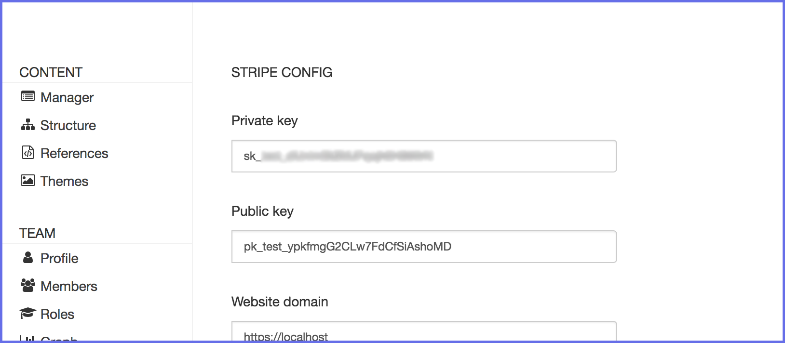

# Config

Create stipe account [https://dashboard.stripe.com/]()

Retrieve the public and private account key [https://dashboard.stripe.com/account/apikeys]()


Copy/paste those key to abe stripe admin [http://localhost:3000/abe/plugin/abe-stripe/config]()



# Products

Choose the template(s) on abe admin that correspond to a product page

Exemple: the template single is my product page


Go edit a `single` template on abe admin


A new tab appear called `Stripe`

- Product name
- Product description
- Product shippable
- Product currency


# Sku

A product can own many skus

For exemple I want my badass product to have size and color

Abe-stripe add a new references file [https://localhost:3000/abe/reference]() called **abe-stripe-attributes.json**

```json
[
	{
		"name": "size",
		"source": [
			"10",
			"11",
			"12",
			"14",
			"15",
			"16",
			"17",
			"18",
			"19",
			"20",
			"21",
			"22",
			"23"
		]
	},
	{
		"name": "color",
		"source": [
			"red",
			"yellow",
			"blue"
		]
	}
]
```

So if go back to `single` template you will be able to add


# Stripe product

You can retrieve your product inside your stripe account 


Also the sku inside the product detail (size `10`, color `red`)


